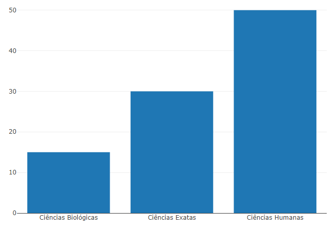

# Instalação

Instalar via CRAN.

    install.packages("plotly")

# Gráficos de renderização

Por padrão, este pacote R é executado localmente no seu navegador da Web
ou no visualizador.plotlyRStudio, Os gráficos criados com o pacote R são
interativos! Clique nas entradas da legenda para ocultar/mostrar traços,
clicar e arrastar no gráfico para ampliar, clicar duas vezes em escala
automática, mudar e arrastar para a panela, quando você compilar no seu
Rstudio.

# Demonstração de Uso

    library(plotly)
    fig <- plot_ly(
      x = c("Ciências Humanas", "Ciências Exatas", "Ciências Biológicas"),
      y = c(50, 30, 15),
      name = "Alunos do IFPE por área de ensino",
      type = "bar"
    )
    fig

# Uso da função plot\_ly()

Fornece uma interface mais direta para o plotly original criado em
javascript e cria gráficos interativos com qualidade de publicação e
usufruir de tipos de gráficos mais elaborados e melhor renderizados
**(EX: Barras, Pizza, linhas , caixas entre outros)**

    library(plotly)

    dat <- data.frame(
        time = factor(c("Energético","Café"), levels=c("Energético","Café")),
        programador_bebe = c(14.89, 17.23)
    )

    p <- ggplot(data=dat, aes(x=time, y=programador_bebe, fill=time)) +
        geom_bar(colour="black", stat="identity") +
        guides(fill=FALSE)

    fig <- ggplotly(p)

    fig

# Uso da função ggplotly()

Com ggplotly () da Plotly, você pode converter suas figuras ggplot2 em
figuras interativas alimentadas por plotly.js, prontas para serem
incorporadas aos aplicativos Dash **(EX: coordenadas paralelas, mapas,
superfícies e malhas)**
