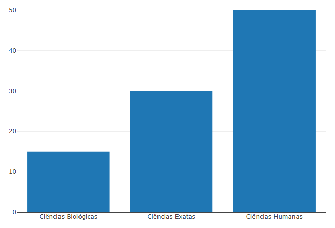

```{r setup, include=FALSE}
knitr::opts_chunk$set(echo = TRUE)
```
# Instalação
Instalar via CRAN.
```{r, eval=FALSE}
install.packages("plotly")
```
# Demonstração de Uso

```{r, eval=FALSE}
library(plotly)
fig <- plot_ly(
  x = c("Ciências Humanas", "Ciências Exatas", "Ciências Biológicas"),
  y = c(50, 30, 15),
  name = "Alunos do IFPE por área de ensino",
  type = "bar"
)
fig
```




# Uso da função plot_ly()
Fornece uma interface mais direta para o plotly original criado em javascript e com isso, podemos usufruir de tipos de gráficos mais elaborados e melhor renderizados. (EX: coordenadas paralelas, mapas, superfícies e malhas)
