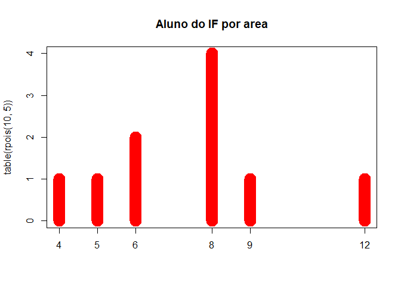

# Instalação

Instalar via CRAN.

    install.packages("plotly")

# Demonstração de Uso

    plot(table(rpois(10, 5)), type = "h", col = "red", lwd = 20,
         main = "Aluno do IF por area")

# Uso da função plot\_ly()

Fornece uma interface mais direta para o plotly original criado em
javascript e com isso, podemos usufruir de tipos de gráficos mais
elaborados e melhor renderizados. (EX: coordenadas paralelas, mapas,
superfícies e malhas)
